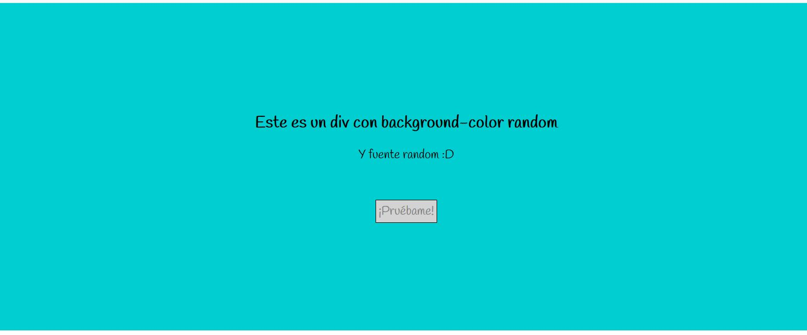
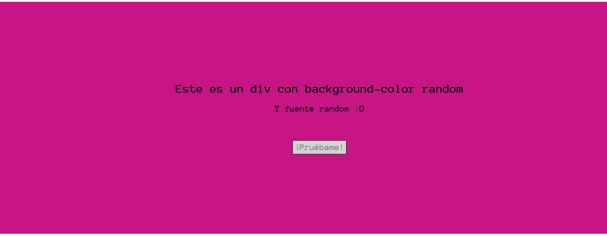
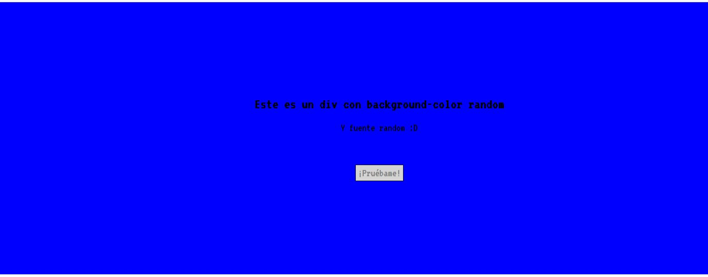

# Random box REACT

* **Track:** _Especialización Front-end_
* **Curso:** _REACT_
* **Unidad:** _Intro a REACT y JSX_

***
## Descripción
Realizar un componente div que contenga 2 elementos y cuyo color de fondo y fuente sean aleatorios al recargas la página.

El producto final deberá verse de la siguiente forma:

## Herramientas

Para este proyecto, se usó las herramientas tecnológicas de HTML5, CSS3 y la librería de JS, REACT.